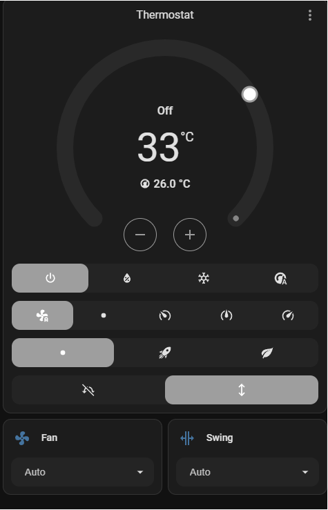
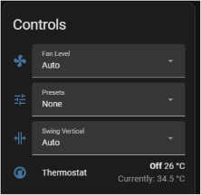
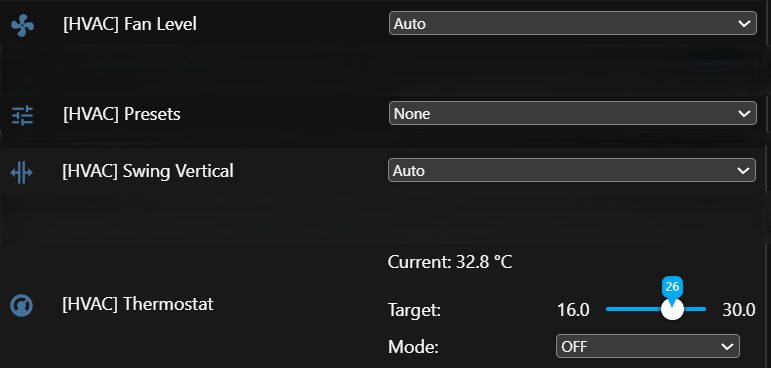
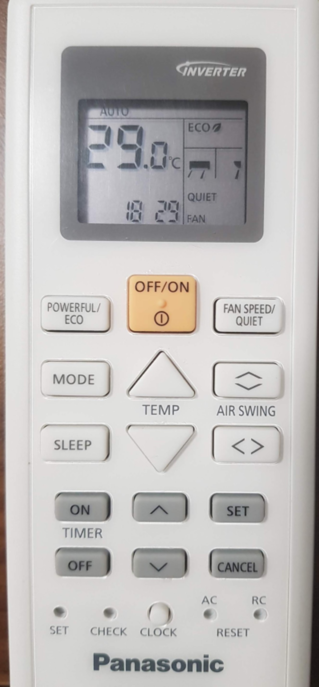

# Panasonic AC IR Remote Controller for ESPHome

**_This project is maintained in my free time. A coffee ☕ is always appreciated!_**

[](https://www.buymeacoffee.com/hoangminh1109)

This is a custom ESPHome external component for controlling Panasonic air conditioners via infrared.

It **inherits from ESPHome's `ClimateIR`** and adds support for:
- **IR Receiver** to detect and decode Panasonic AC remote commands (216 bit frame)
- **Temperature step** (0.5 or 1.0 degree)
- **Fan Level Control** (1–5, plus quiet)
    - Default 3 levels without quiet; 5 levels and quiet can be enabled separately
- **Swing Control**:
  - **Vertical Swing** (Highest, High, Middle, Low, Lowest, Auto)
  - **Horizontal Swing** (Left Max, Left, Middle, Right, Right Max, Auto) — off by default, can be enabled
- **Presets**:
  - Powerful (aka Boost in HA)
  - Eco

---

## 🛠 Features

- ✅ Compatible with Panasonic IR protocol (216 bit - 27 bytes frame)
- ✅ Based on ESPHome `ClimateIR` class for climate control
- ✅ IR receiver support to sync state from physical remote
- ✅ `select` components for:
  - Fan level
  - Swing vertical
  - Swing horizontal
  - Presets
- ✅ Auto state updates when IR signal is received

---

## 📦 Hardware Installation

You need an ESP32 or ESP8266 board. There are two ways to connect it to your AC.

### Method 1 — Invasive (recommended for permanent installs)

Connect the ESP board directly to the AC's IR board. Requires physical access to the AC IR board.

- ESP GND → AC IR board GND
- ESP 5V → AC IR board VCC (verify your IR board supplies 5V)
- ESP GPIO ↔ AC IR board IR LED output


With this method the ESP intercepts the IR signal directly on the wire, so `ir_control` should be `false` — no carrier frequency is needed.

### Method 2 — Non-invasive (good for testing)

Build a separate IR LED receiver and IR LED transmitter circuit (via transistor) and connect them to ESP GPIOs. See the schematic below.


Place the ESP module near the AC indoor unit so that:
- Its IR receiver can pick up signals from the physical remote
- Its IR transmitter LED points at the AC's IR sensor

With this method the ESP transmits a real IR signal through the air, so `ir_control` must be `true` to enable the carrier frequency.

> **Recommendation:** use Method 2 during testing, then switch to Method 1 for permanent installation. Method 1 is significantly more stable.

---

## 📂 Installation

1. Copy the `esphome/components/panaac` folder to your ESPHome `components` folder.
2. Add the climate component to your ESPHome YAML configuration (see example files `ac-test-1.yaml` and `ac-test-2.yaml`).

Alternatively, reference the repository directly in your YAML:

```yaml
external_components:
  - source:
      type: git
      url: https://github.com/hoangminh1109/PanaAC_ESPHome
    components: [ panaac ]
    refresh: 0s
```

---

## ⚙️ Optional Parameters

| Parameter           | Type  | Default | Description                                       |
|---------------------|-------|---------|---------------------------------------------------|
| `receiver_id`       | id    | —       | ID of the `remote_receiver` component             |
| `temp_step`         | float | `1.0`   | Temperature step in degrees (`0.5` or `1.0`)      |
| `supports_heat`     | bool  | `false` | Enable Heat mode                                  |
| `supports_fan_only` | bool  | `false` | Enable Fan-Only mode                              |
| `supports_quiet`    | bool  | `false` | Enable Quiet fan level                            |
| `fan_5level`        | bool  | `false` | Expose all 5 fan levels (default is 3)            |
| `swing_horizontal`  | bool  | `false` | Enable horizontal swing control                   |
| `supports_powerful` | bool  | `false` | Enable Powerful (Boost) preset                    |
| `supports_eco`      | bool  | `false` | Enable Eco preset                                 |
| `ir_control`        | bool  | `false` | Set `true` for non-invasive IR transmitter wiring |

---

## 📋 YAML Examples

### Invasive wiring (Method 1) — shared GPIO, no carrier

```yaml
remote_receiver:
    pin:
        number: GPIO4
        inverted: true
        mode: OUTPUT_OPEN_DRAIN
        allow_other_uses: true # needed for shared pin
    tolerance: 55%
    id: ir_receiver
    idle: 5ms # required — see IR Frame Timing note above

remote_transmitter:
    carrier_duty_percent: 50%
    pin:
        number: GPIO4
        inverted: true
        mode: OUTPUT_OPEN_DRAIN
        allow_other_uses: true # needed for shared pin

climate:
    - platform: panaac
      name: "Remote Controller"
      receiver_id: ir_receiver
      supports_fan_only: true
      supports_heat: true
      supports_quiet: true
      fan_5level: true
      swing_horizontal: false
      temp_step: 0.5
      ir_control: false
```

### Non-invasive wiring (Method 2) — separate GPIOs, carrier enabled

```yaml
remote_receiver:
    pin:
        number: GPIO14
        inverted: true
    tolerance: 55%
    id: ir_receiver
    idle: 5ms # required — see IR Frame Timing note above

remote_transmitter:
    carrier_duty_percent: 50%
    pin:
        number: GPIO13

climate:
    - platform: panaac
      name: "Remote Controller"
      receiver_id: ir_receiver
      supports_fan_only: true
      supports_heat: true
      supports_quiet: true
      fan_5level: true
      swing_horizontal: true
      temp_step: 0.5
      ir_control: true
```

### Enabling presets (Powerful / Eco)

```yaml
climate:
  - platform: panaac
    name: Thermostat
    id: thermostat
    device_id: hvac
    supports_powerful: true
    supports_eco: true
```

---

## ⚠️ Important: IR Frame Timing

The Panasonic AC IR protocol sends 2 frames:
- A fixed 8-byte preamble frame (transmission marker)
- A 19-byte command frame containing the AC state
- A 10 ms gap between the two frames

The default ESPHome `remote_receiver` idle time is also 10 ms. Because the frame gap and the idle timeout are the same duration, frame detection is unstable — sometimes the receiver sees a single 27-byte frame, sometimes two separate frames.

**The fix:** set `idle: 5ms` on your `remote_receiver`. This ensures the receiver always splits the signal into two frames, making reception reliable. This is required in all configurations.

---

## 🖼️ Screenshots

Home Assistant:




ESPHome WebUI:


---

## 📝 Testing

Tested with ESP8266 and ESP32 using these Panasonic AC remotes and series:
  - QKH
  - SKH
  - TKH
  - WKH




Feedback and bug reports are welcome — please open an issue if you run into any problems.
